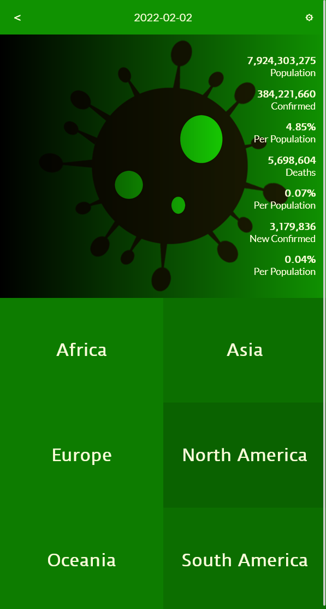

# Covidata

> A website showing all Covid19 related statistics per country.

Additional description about the project and its features.

## Built With

- React
- Redux
- Jest

## Live Demo

[Live Demo Link](https://qwibbler-covidata.netlify.app/)
[Video Introduction](https://www.loom.com/share/d40f5367c7ef48048fb699073566f354)

## Getting Started

To get a local copy up and running follow these simple example steps.

### Prerequisites

NodeJS

### Setup

- Clone the repository and `cd` into the folder.

### Install

- Run `npm install` on your terminal.
- Run `npm build`
- Go to the `build` folder, and open `index.html` to run the website.

### Usage

- Find the country whose stats you are interested in.
- Discover all of the country's current stats, as well as their stats by population.
- To change the date of the data, click the 'edit pencil' in the top right corner, or double click the date.

### Run tests

- Run `npm test` to run the tests.

### Deployment

- Deployed at [Netlify](https://qwibbler-covidata.netlify.app/)

## Authors

👤 **Humaira Zaman**

- GitHub: [@qwibbler](https://github.com/qwibbler)
- Twitter: [@hmemaz](https://twitter.com/hmemaz)
- LinkedIn: [Humaira Zaman](https://www.linkedin.com/in/hmemaz1994/)

## 🤝 Contributing

Contributions, issues, and feature requests are welcome!

Feel free to check the [issues page](../../issues/).

## Show your support

Give a ⭐️ if you like this project!

## Acknowledgments

- Design idea by [Nelson Sakwa](https://www.behance.net/sakwadesignstudio) on [Behance](https://www.behance.net/gallery/31579789/Ballhead-App-(Free-PSDs)).
- Virus Image by rawpixel.com vexels.com

## 📝 License

This project is [MIT](./MIT.md) licensed.
